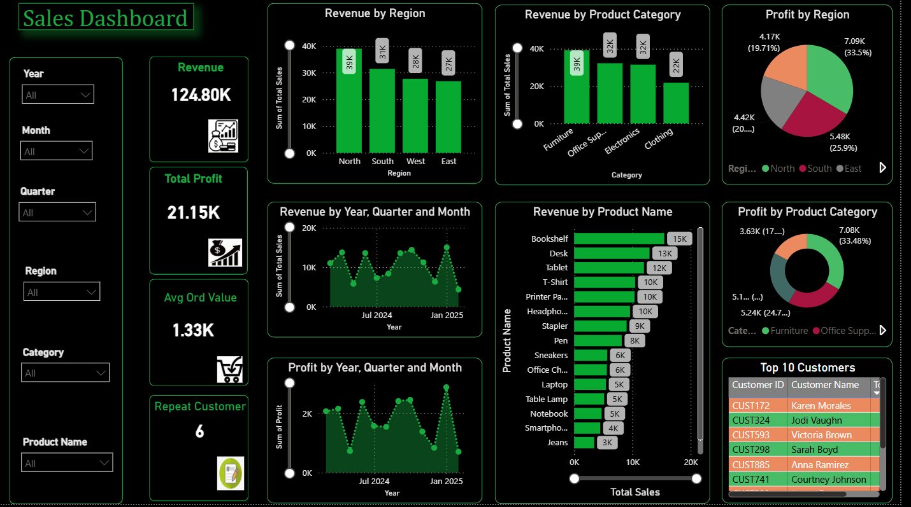
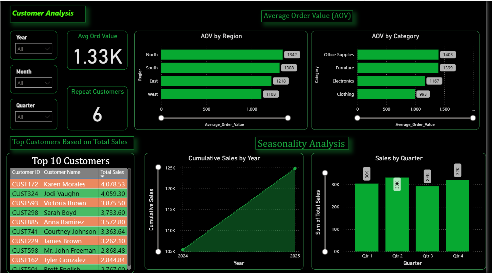
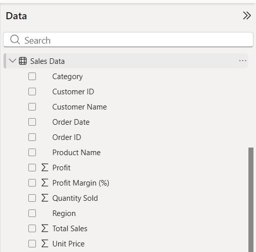
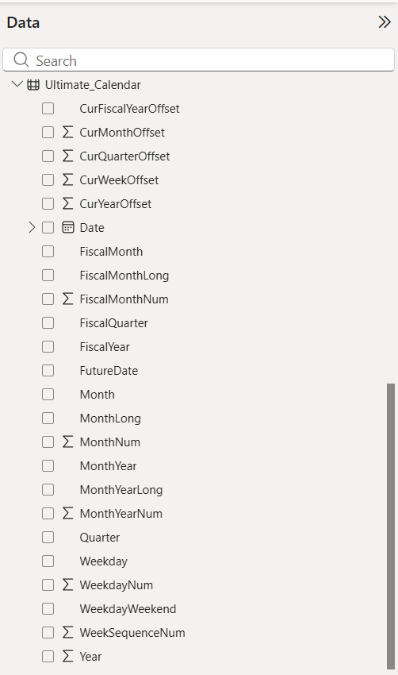
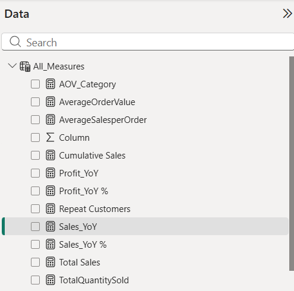

# Power BI Sales Analytics Dashboard

Interactive Business Intelligence dashboard built with **Microsoft Power BI** to analyze sales performance, profitability, customer behavior, and business growth through dynamic visualizations and executive KPIs.

---------------


-----------

## Project Overview

This project demonstrates how Business Intelligence transforms raw transactional sales data into meaningful insights for strategic decision-making.

The dashboard enables executives, business managers, and analysts to monitor organizational performance through interactive visualizations, key performance indicators (KPIs), and trend analysis.

The solution focuses on sales performance, profitability, customer behavior, product performance, and seasonal trends.

----------

# Dashboard Preview

## Executive Sales Dashboard



## Customer Analytics Dashboard



----------
## Dataset

The dashboard is built using a sales transaction dataset containing information about customers, products, orders, profitability, and regions.

### Dataset Fields

| Field | Description |
|--------|-------------|
| Order ID | Unique order identifier |
| Order Date | Transaction date |
| Customer ID | Customer identifier |
| Customer Name | Customer name |
| Product Name | Product purchased |
| Category | Product category |
| Region | Sales region |
| Quantity Sold | Quantity ordered |
| Unit Price | Product selling price |
| Total Sales | Revenue generated |
| Profit | Profit earned |
| Profit Margin (%) | Profit percentage |
------
## Data Model

The project follows a clean Power BI data model to support efficient reporting and time intelligence.

### Tables

### Sales Data

Fact table containing all sales transactions.



---

### Ultimate Calendar

Custom calendar table used for:

- Time Intelligence
- Year-over-Year Analysis
- Quarter Analysis
- Month Analysis
- Fiscal Reporting



---

### All Measures

Dedicated table containing all DAX measures used throughout the dashboard.


---
## Business Problem

Organizations collect vast amounts of sales data every day. However, without effective reporting and visualization, valuable business insights remain hidden.

Decision-makers often struggle to answer questions such as:

- Which regions generate the highest revenue?
- Which products contribute the most profit?
- Who are our highest-value customers?
- How are sales changing over time?
- What seasonal patterns exist?
- Which categories should receive greater investment?

This dashboard answers these questions through an interactive reporting solution built with Microsoft Power BI.

--------

## Project Objectives

- Build an executive sales dashboard.
- Monitor key business performance indicators.
- Analyze customer purchasing behavior.
- Compare sales performance across regions.
- Evaluate product category profitability.
- Track revenue and profit trends over time.
- Calculate Average Order Value (AOV).
- Measure year-over-year business growth.

-----
## Dashboard Features

### Executive Dashboard

- Revenue KPI
- Total Profit KPI
- Average Order Value (AOV)
- Repeat Customers
- Revenue by Region
- Revenue by Product Category
- Profit by Region
- Profit by Category
- Monthly Revenue Trend
- Monthly Profit Trend
- Product Performance
- Top Customers

---

### Customer Analytics

- Customer Segmentation
- Average Order Value by Region
- Average Order Value by Category
- Repeat Customer Analysis
- Top 10 Customers
- Cumulative Sales
- Quarterly Sales Analysis

---
## Repository Structure

```text
powerbi-sales-analytics-dashboard/
│
├── reports/
│   └── Sales Analytics Dashboard.pbix
│
├── data/
│
├── docs/
│
├── images/
│
├── assets/
│
├── LICENSE
└── README.md
```
